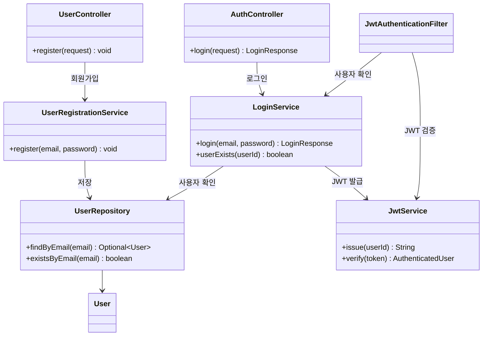
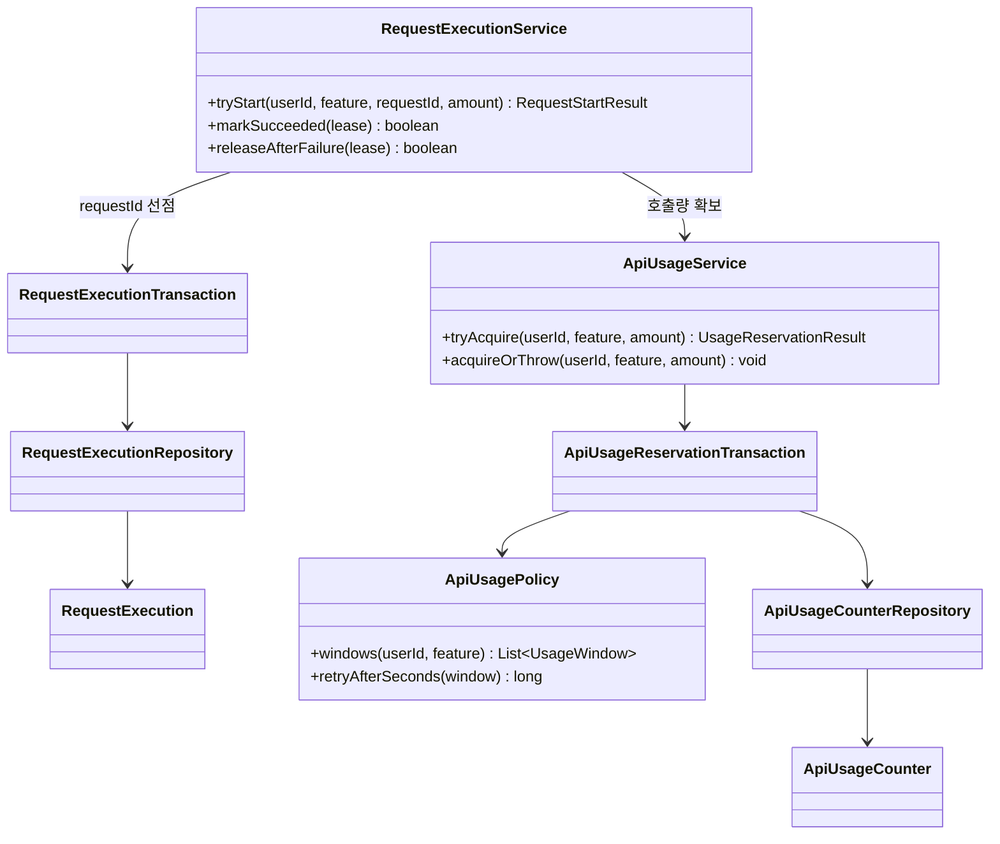
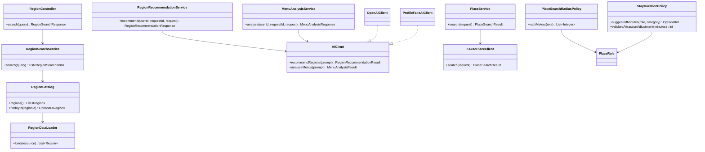
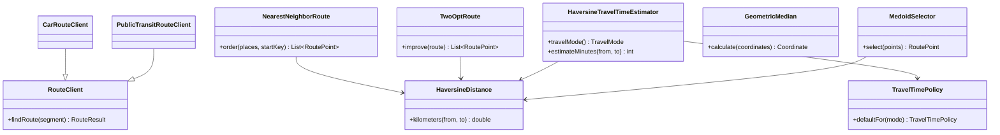

# ✈️ Routy

> **국내 여행 지역과 관광지를 선택하면 체류시간과 이동시간을 반영해
> 자동차 또는 대중교통 여행 일정을 만들어주는 서비스입니다.**

<p align="center">
  
  
  
  
  
</p>
 
---

## 🌍 프로젝트 소개

여행을 계획할 때는 단순히 관광지를 찾는 것뿐 아니라,

* 어디를 방문할지
* 어떤 순서로 이동할지
* 각 장소에 얼마나 머무를지
* 어느 지역에서 숙박하고 식사할지
* 자동차와 대중교통 중 무엇으로 이동할지

까지 함께 고려해야 합니다.

**Routy**는 서울특별시·광역시·세종특별자치시 또는 도·특별자치도 아래 시·군 하나를 여행 지역으로 선택하고, 카카오에서 찾은 관광지·숙소·음식점을 사용자가 직접 고르면 **체류시간과 이동시간을 반영한 하나의 여행 일정으로 구성해주는 서비스**입니다. 지역을 직접 선택하는 대신 AI에게 여행 성향에 맞는 국내 지역 후보 3개와 이유를 추천받을 수도 있습니다.

예를 들어,

```text
부산광역시 2박 3일 여행

✓ 자동차로 이동
✓ 해운대구를 관광지 검색 필터로 선택
✓ 해운대와 청사포는 꼭 방문
✓ 돼지국밥과 회를 먹고 싶음
```

와 같이 선택하고 입력하면,

```text
국내 여행 지역 선택 또는 AI 지역 추천
    ↓
관광지 선택과 체류시간 조정
    ↓
숙소 지도 탐색과 직접 선택
    ↓
AI 메뉴 후보 확정
    ↓
Haversine 기반 일정 추정
    ↓
음식점 지도 탐색과 직접 선택
    ↓
최종 인접 구간 실제 경로 검증
    ↓
완료 일정 저장
```

의 형태로 여행 계획을 제공합니다.

---

## 🧭 설계 원칙

Routy는 AI와 Spring Backend의 책임을 분리합니다.

* AI는 허용된 국내 지역 목록에서 후보 3개와 이유를 만들고, 음식 자연어를 메뉴·검색어·이유·기준 관광지 후보로 구조화합니다.
* 서버는 인증·인가, 장소 검증, 거리·순서·시간 계산, 음식점 추천 점수, 저장과 외부 장애 처리를 담당합니다.
* AI는 장소의 존재, 방문 순서, 시간표, 추천 점수와 저장 성공을 결정하지 않습니다.
* Haversine·Nearest Neighbor·2-opt로 먼저 계산하고, 최종 후보의 인접 구간만 실제 경로 API로 검증합니다.
* 외부 호출과 계산 중에는 DB 트랜잭션을 열지 않고, 모든 검증이 끝난 뒤 짧은 트랜잭션으로 완료 일정 전체를 저장합니다.

---

## ✨ 목표 기능

* 🌏 국내 최종 여행 지역 직접 선택과 AI 지역 후보 3개 추천
* 📍 카카오 기반 관광지 검색·검증과 사용자 표시 이름 입력
* ⏱️ 장소별 기본 체류시간 계산과 10분 단위 조정 정책
* 🔁 Haversine·Nearest Neighbor·2-opt 기반 추정 동선 구성
* 🚗 자동차 또는 대중교통 실제 경로 검증
* 🏨 기하 중앙값·메도이드·현재 지도 영역 기반 숙소 탐색
* 🍽️ AI 메뉴 구조화와 동선 이탈이 작은 음식점 탐색
* 📅 1~7일 일정과 점심·저녁 시간대 배치
* 💾 완료 일정 저장·조회·제한 편집·삭제
* 🔗 외부 API 호출 없는 완료 일정 공유
* 🔐 회원가입·JWT 인증·일정 소유권
* 🚦 사용자별 AI·장소·경로 호출 한도와 fallback

---

## 🚀 구현 상태와 다음 작업

구현·검증의 현재 상태는 [구현 준비도](./docs/07-implementation-readiness.md), 다음 작업은 [작업 로드맵 16절](./docs/11-command-roadmap.md)을 따른다. README에는 단계별 완료 이력과 테스트 수를 중복 기록하지 않는다.

---

## 🧩 초기 클래스 구조 기록

아래는 초기 개발 단계의 클래스 구조 기록입니다. 최신 구현 상태와 책임 경계는 실제 소스 및 [아키텍처 문서](./docs/02-architecture.md)를 따릅니다.

```text
com.example.travel
├── TravelApplication
├── user
│   ├── controller     # AuthController, UserController
│   ├── service        # 회원가입·로그인·호출 한도·requestId 실행 상태
│   ├── repository     # User·ApiUsageCounter·RequestExecution Repository
│   ├── domain         # User, ApiUsageCounter, RequestExecution과 상태 enum
│   ├── dto            # 인증·호출 한도·requestId 전달 객체
│   ├── validation     # PasswordFormat, PasswordSize 검증
│   ├── config         # PasswordConfig
│   └── ...
├── region
│   ├── controller     # 인증 지역 검색 HTTP 요청 처리
│   ├── service        # RegionCatalog, RegionSearchService, AiAllowedRegionService
│   ├── loader         # regions.json 적재와 시작 시 무결성 검증
│   ├── domain         # Region·주소 경계·대표 좌표 값 객체
│   └── dto            # 검색 응답과 AI 허용 지역 전달 객체
├── ai
│   ├── controller     # RegionRecommendationController, MenuAnalysisController
│   ├── client         # AiClient, OpenAiClient, ProfileFakeAiClient와 설정
│   ├── service        # RegionRecommendationService, MenuAnalysisService
│   └── dto            # AI 기능 요청·응답과 허용 후보 전달 객체
├── place
│   ├── client         # KakaoPlaceClient 계약, 요청·후보·결과 DTO와 오류 분류
│   ├── service        # PlaceService Client 경계
│   └── domain         # PlaceRole, 역할별 반경과 기본 체류시간 정책
├── route
│   ├── client         # 자동차·대중교통 Client 계약, 결과 DTO와 오류 분류
│   └── algorithm      # Coordinate·Haversine, Nearest Neighbor, 2-opt,
│                      # 이동수단별 시간 추정, 기하 중앙값·메도이드
└── global
    ├── security       # JwtService, JwtAuthenticationFilter, SecurityConfig 등
    └── exception      # ApiException, ErrorCode, ErrorResponse, Handler 등
```

아래 UML은 한 화면에서 흐름을 따라갈 수 있도록 책임별로 나눴습니다. 세부 필드와 전체 의존 관계는 마지막의 상세 UML에서 확인할 수 있습니다.

### 회원·인증



### 호출 한도·중복 요청



### 지역·AI·장소



### 경로 Client·순수 알고리즘



<details>
<summary><strong>전체 클래스 상세 UML 펼치기</strong></summary>



</details>

```mermaid
classDiagram
direction TB

class UserController {
  <<RestController>>
  +register(UserRegistrationRequest) void
}
class AuthController {
  <<RestController>>
  +login(LoginRequest) LoginResponse
}
class UserRegistrationService {
  <<Service>>
  +register(email, password) void
}
class LoginService {
  <<Service>>
  +login(email, password) LoginResponse
  +userExists(userId) boolean
}
class UserRepository {
  <<JpaRepository>>
  +findByEmail(email) Optional~User~
  +existsByEmail(email) boolean
}
class User {
  <<Entity>>
  -Long id
  -String email
  -String passwordHash
  -Instant createdAt
  -Instant updatedAt
}

class JwtAuthenticationFilter {
  <<Security Filter>>
}
class JwtService {
  <<Service>>
  +issue(userId) String
  +verify(token) AuthenticatedUser
}
class JwtProperties {
  <<ConfigurationProperties>>
  +String issuer
  +Duration accessTokenTtl
  +String activeKeyId
}
class AuthenticatedUser {
  <<record>>
  +long userId
}
class SecurityConfig {
  <<Configuration>>
}
class RestAuthenticationEntryPoint {
  <<Component>>
}
class RestAccessDeniedHandler {
  <<Component>>
}

class RequestExecutionService {
  <<Service>>
  +tryStart(userId, feature, requestId, amount) RequestStartResult
  +markSucceeded(lease) boolean
  +releaseAfterFailure(lease) boolean
}
class RequestExecutionTransaction {
  <<Transactional Service>>
}
class RequestExecutionRepository {
  <<JpaRepository>>
}
class RequestExecution {
  <<Entity>>
  -Long userId
  -UsageFeature feature
  -UUID requestId
  -RequestExecutionStatus status
  -Instant expiresAt
}

class ApiUsageService {
  <<Service>>
  +tryAcquire(userId, feature, amount) UsageReservationResult
  +acquireOrThrow(userId, feature, amount) void
}
class ApiUsageReservationTransaction {
  <<Transactional Service>>
}
class ApiUsagePolicy {
  <<Component>>
  +windows(userId, feature) List~UsageWindow~
}
class ApiUsageCounterRepository {
  <<JpaRepository>>
}
class ApiUsageCounter {
  <<Entity>>
  -UsageScopeType scopeType
  -String scopeId
  -UsageFeature feature
  -UsageWindowType windowType
  -long usedCount
  -Instant expiresAt
}

class RegionController {
  <<RestController>>
  +search(query) RegionSearchResponse
}
class RegionSearchService {
  <<Service>>
  +search(query) List~RegionSearchItem~
}
class RegionCatalog {
  <<Service>>
  +regions() List~Region~
  +findById(regionId) Optional~Region~
}
class RegionDataLoader
class Region {
  <<Value Object>>
}

class RegionRecommendationService {
  <<Service>>
  +recommend(request, allowedRegions) RegionRecommendationResponse
}
class MenuAnalysisService {
  <<Service>>
  +analyze(request) MenuAnalysisResponse
}
class AiClient {
  <<interface>>
  +recommendRegions(prompt) RegionRecommendationResult
  +analyzeMenus(prompt) MenuAnalysisResult
}
class OpenAiClient
class ProfileFakeAiClient
class OpenAiClientConfiguration {
  <<Configuration>>
}
class OpenAiProperties {
  <<ConfigurationProperties>>
}

class KakaoPlaceClient {
  <<interface>>
  +search(request) PlaceSearchResult
}
class PlaceService {
  +search(request) PlaceSearchResult
}
class PlaceRole {
  <<enumeration>>
  ATTRACTION
  HOTEL
  RESTAURANT
}
class PlaceSearchRadiusPolicy {
  +radiiMeters(role) List~Integer~
}
class StayDurationPolicy {
  +suggestedMinutes(role, category) OptionalInt
  +validateAttractionAdjustment(minutes) int
}

class RouteClient {
  <<interface>>
  +findRoute(segment) RouteResult
}
class CarRouteClient {
  <<interface>>
}
class PublicTransitRouteClient {
  <<interface>>
}
class RouteResult {
  <<record>>
}

class Coordinate {
  <<record>>
  +double latitude
  +double longitude
}
class RoutePoint {
  <<record>>
  +String stableKey
  +Coordinate coordinate
}
class HaversineDistance {
  +kilometers(from, to) double
}
class NearestNeighborRoute {
  +order(places, startKey) List~RoutePoint~
}
class TwoOptRoute {
  +improve(route) List~RoutePoint~
}
class TravelMode {
  <<enumeration>>
  CAR
  PUBLIC_TRANSIT
}
class TravelTimePolicy {
  <<record>>
  +defaultFor(mode) TravelTimePolicy
}
class HaversineTravelTimeEstimator {
  +estimateMinutes(from, to) int
}
class GeometricMedian {
  +calculate(coordinates) Coordinate
}
class MedoidSelector {
  +select(places) RoutePoint
}

class GlobalExceptionHandler {
  <<RestControllerAdvice>>
}
class ApiException
class ErrorCode {
  <<enumeration>>
}
class ErrorResponse {
  <<record>>
}

UserController --> UserRegistrationService
AuthController --> LoginService
UserRegistrationService --> UserRepository
UserRegistrationService ..> User
LoginService --> UserRepository
LoginService --> JwtService
UserRepository --> User

SecurityConfig --> JwtAuthenticationFilter
SecurityConfig --> RestAuthenticationEntryPoint
SecurityConfig --> RestAccessDeniedHandler
JwtAuthenticationFilter --> JwtService
JwtAuthenticationFilter --> LoginService
JwtAuthenticationFilter --> RestAuthenticationEntryPoint
JwtService --> JwtProperties
JwtService ..> AuthenticatedUser

RequestExecutionService --> RequestExecutionTransaction
RequestExecutionService --> ApiUsageService
RequestExecutionTransaction --> RequestExecutionRepository
RequestExecutionRepository --> RequestExecution

ApiUsageService --> ApiUsageReservationTransaction
ApiUsageReservationTransaction --> ApiUsagePolicy
ApiUsageReservationTransaction --> ApiUsageCounterRepository
ApiUsageCounterRepository --> ApiUsageCounter

RegionController --> RegionSearchService
RegionSearchService --> RegionCatalog
RegionCatalog --> RegionDataLoader
RegionCatalog --> Region

RegionRecommendationService --> AiClient
MenuAnalysisService --> AiClient
OpenAiClient ..|> AiClient
ProfileFakeAiClient ..|> AiClient
OpenAiClientConfiguration --> OpenAiClient
OpenAiClientConfiguration --> OpenAiProperties

PlaceService --> KakaoPlaceClient
PlaceSearchRadiusPolicy --> PlaceRole
StayDurationPolicy --> PlaceRole
CarRouteClient --|> RouteClient
PublicTransitRouteClient --|> RouteClient
RouteClient ..> RouteResult

RoutePoint --> Coordinate
NearestNeighborRoute --> HaversineDistance
TwoOptRoute --> HaversineDistance
TravelTimePolicy --> TravelMode
HaversineTravelTimeEstimator --> TravelTimePolicy
HaversineTravelTimeEstimator --> HaversineDistance
GeometricMedian ..> Coordinate
MedoidSelector --> HaversineDistance
MedoidSelector ..> RoutePoint

UserRegistrationService ..> ApiException
LoginService ..> ApiException
ApiUsageService ..> ApiException
RequestExecutionTransaction ..> ApiException
GlobalExceptionHandler --> ApiException
GlobalExceptionHandler ..> ErrorResponse
ApiException --> ErrorCode
ErrorResponse --> ErrorCode
```

주요 요청은 다음과 같이 흐릅니다.

```text
회원가입: UserController → UserRegistrationService → UserRepository → User
로그인:   AuthController → LoginService → UserRepository + JwtService
인증:     JwtAuthenticationFilter → JwtService → LoginService.userExists()
지역 검색: RegionController → RegionSearchService → RegionCatalog → RegionDataLoader
AI 구조화: RegionRecommendationService 또는 MenuAnalysisService → AiClient
           ├── ProfileFakeAiClient  (local·test)
           └── OpenAiClient         (prod·smoke)
장소 Client 경계: PlaceService → KakaoPlaceClient
장소 정책: PlaceRole → PlaceSearchRadiusPolicy + StayDurationPolicy
경로 Client 계약: CarRouteClient 또는 PublicTransitRouteClient → RouteClient
외부 기능 실행 준비:
          RequestExecutionService
          ├── RequestExecutionTransaction  (동일 requestId 중복 실행 방지)
          └── ApiUsageService              (사용자·서비스 호출량 확보)
```

Controller는 HTTP와 DTO 검증만 담당하고, Service가 유스케이스와 트랜잭션 순서를 조합하며, Repository는 같은 `user` 도메인의 DB 접근만 담당합니다. `RegionCatalog`는 검증된 정적 지역 데이터를 메모리에 제공하고, AI Service는 제공자 응답을 그대로 신뢰하지 않고 허용 ID·개수·중복·필수 필드를 검증합니다. `RequestExecutionService`는 중복 요청 상태를 먼저 확보한 뒤 호출량을 예약하며, 처리 실패 시 실행 상태를 해제할 수 있도록 구성되어 있습니다.

---

## 🛠 Tech Stack

### Backend

<p>
  
  
  
  
</p>

### Database & Infrastructure

<p>
  
  
  
</p>

### AI & External API

<p>
  
  
  
  
</p>

### Tools

<p>
  
  
  
</p>

Spring Data JPA·MySQL·Flyway·Spring Security·JWT와 OpenAI Client는 구현·검증됐습니다. 카카오 장소·자동차·대중교통 Client는 계약·DTO·오류 분류와 Fake까지 구현했으며 실제 HTTP Client는 아직 구현하지 않았습니다. 실제 OpenAI 호출은 `prod`·`smoke` profile에서만 활성화하고 자동 테스트는 Fake와 로컬 HTTP 서버를 사용합니다.

### Frontend (계획)

Spring Boot의 `src/main/resources/static/Routy/**`에서 별도 프론트 빌드 도구 없이 동작하는 Vanilla HTML·CSS·JavaScript UI를 구현했습니다. Landing, Auth, Journey Workspace, My Trips, Trip Detail, Shared Trip의 화면 골격과 8단계 Workspace를 만들었고, 회원가입·로그인 API와 메모리 인증 상태를 연결했습니다. `travela-1.0.0/**`은 참고용 원본 템플릿으로 보존하고 실제 서비스 화면에는 `Routy/**`만 사용합니다.

JWT는 현재 탭 JavaScript 메모리에만 보관하고 로그아웃·만료·새로고침·탭 종료 시 폐기합니다. 작성 중 카카오 좌표는 후속 장소 기능에서 브라우저 JavaScript 메모리와 해당 서버 요청에서만 일시적으로 사용하고, 완료·취소·새로고침·탭 종료와 요청 처리가 끝나면 즉시 폐기할 예정입니다.

---

## 🧱 아키텍처와 책임 경계

도메인 중심 패키지 구조를 사용하며 Controller·Service·Repository·DTO·Entity의 책임을 분리합니다.

```text
API Controller
      ↓
Application Service
      ├── User Service           : 인증·소유권·사용자별 호출 한도
      ├── Region Service         : 국내 행정구역 기준과 검색
      ├── Place Service          : 카카오 장소 검색·검증·선택
      ├── Route Service          : 거리·방문 순서·실제 경로 검증
      ├── Recommendation Service : 음식점 후보 점수와 정렬
      ├── AI Service             : 지역 후보와 메뉴 구조화
      └── TravelPlan Service     : 일정 계산·저장·조회·편집·공유
      ↓
Repository / External Client
```

외부 HTTP 구현은 OpenAI=`ai/client`, 카카오 장소=`place/client`, 경로=`route/client`에 격리합니다. `route/algorithm`은 Spring·JPA·HTTP·AI에 의존하지 않는 순수 Java로 유지합니다. 다른 도메인은 공개 Service와 전달 DTO로만 사용합니다.

---

## 🔒 데이터와 보안

* 영속 저장하는 장소 정보는 카카오 장소 ID·URL, 사용자가 작성한 표시 이름·메모, 확정 체류시간과 자체 일정 정보입니다.
* 카카오 장소명·좌표·주소·전화번호·카테고리, 검색·경로 원문과 AI 원문은 저장하지 않습니다.
* 좌표는 한 번의 일정 제작 흐름과 서버 요청에서만 일시적으로 사용하고 즉시 폐기합니다.
* 호출 카운터와 `requestId` 처리 상태는 MySQL 공유 저장소에 두되 좌표·payload·response는 저장하지 않습니다.
* 자동 테스트는 실제 OpenAI·카카오 API를 호출하지 않으며 Fake Client를 사용합니다.
* 비밀값과 개인정보는 코드·Git·fixture·로그·오류 응답에 남기지 않습니다.

---

## 📚 Documents

상세 요구사항과 설계 문서는 [`docs/`](./docs)에서 관리합니다.

```text
docs/
├── 00-docs-index.md
├── 01-requirements.md
├── 02-architecture.md
├── 03-database.md
├── 04-api-spec.md
├── 05-development-plan.md
├── 06-decisions.md
├── 07-implementation-readiness.md
├── 08-test-strategy.md
├── 09-operations.md
├── 10-definition-of-done.md
├── 11-command-roadmap.md
└── 12-harness-boundaries.md
```

문서 역할과 권장 읽기 순서는 [`docs/00-docs-index.md`](./docs/00-docs-index.md), 실제 구현 상태는 [`docs/07-implementation-readiness.md`](./docs/07-implementation-readiness.md), 작업 순서와 완료 판정은 [`docs/11-command-roadmap.md`](./docs/11-command-roadmap.md)를 기준으로 합니다.

---

## 🧪 개발·운영 기준

* Controller는 HTTP Request·Response, DTO validation과 Service 호출만 담당합니다.
* DB 스키마 변경은 새 Flyway versioned migration으로 관리하고 적용된 migration은 수정하지 않습니다.
* 로컬 기본 실행과 자동 테스트에서는 실제 외부 API를 호출하지 않습니다.
* 실제 연동은 키·호출 한도·비용을 통제한 별도 smoke 환경에서만 확인합니다.
* 완료 표시는 [`docs/10-definition-of-done.md`](./docs/10-definition-of-done.md)를 확인한 뒤에만 합니다.
